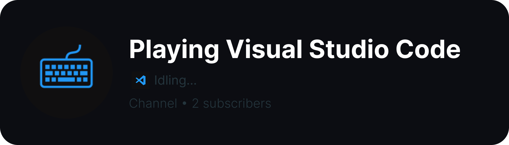
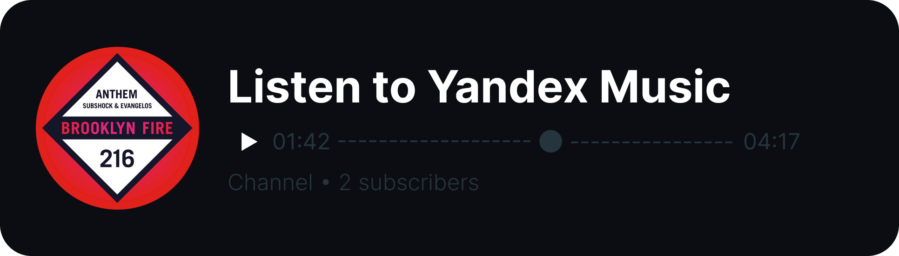

# Telegram RPC




<br>

*[> Читать на русском ](./res/README_RU.md)*

# How does it work?

**Telegram doesn't have built-in RPC or anything like that.**

However, if you specify your personal channel in your profile, some information can be displayed:

| **Discord RPC**      | **Telegram Channel** |
| -------------------- | -------------------- |
| Name                 | Channel Name         |
| Large Icon           | Channel Avatar       |
| Details, State, etc. | Last Post Text       |
| Small Icon           | Last Post Media      |

This is a rather unusual method I came up with :/

# Installation Guide

## Standard Setup

1. Make sure you have [Python](https://www.python.org) installed.
2. Install dependencies: `pip install -r ./src/requirements.txt`
3. Set the values in the `.env` file:
```
DISCORD_TOKEN = <Bot Token>
DISCORD_GUILD_ID = <Server ID>
DISCORD_MEMBER_ID = <Member ID>

TELEGRAM_TOKEN = <Bot Token>
TELEGRAM_CHAT_ID = <Channel ID>
```
4. *Optionally, in `config.py`, you can configure proxy settings, activity headers, etc.*
5. **Run: `python ./src/.`**

## Docker Setup
1. **Build the image: `docker build -t tg-rpc .`**
2. Create a container and set all necessary environment variables:

```
DISCORD_TOKEN = <Bot Token>
DISCORD_GUILD_ID = <Server ID>
DISCORD_MEMBER_ID = <Member ID>
DISCORD_PROXY = <Proxy URL: http://127.0.0.1:2080>

TELEGRAM_TOKEN = <Bot Token>
TELEGRAM_CHAT_ID = <Channel ID>
```
3. **In `config.py`, you can configure the proxy, activity headers, etc.**

# How to get a token?
* Discord: [Discord Developer Portal](https://discord.com/developers/applications)
* Telegram: [@BotFather](https://t.me/BotFather)
