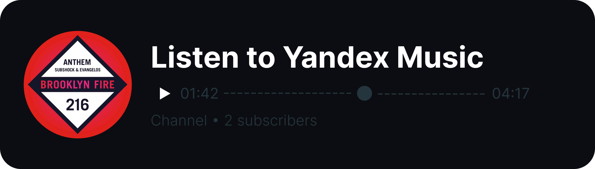

# Telegram RPC




<br>

_[> Read on english ](/README.md)_

# Как это работает?
**Telegram не имеет встроенного RPC или что-то похожее на это.**

Однако, если указать в своем профиле личный канал, можно отобразить некоторую информацию:

| **Активность в Discord** | **Telegram канал** |
| ------------------------ | -------------------|
| Name                     | Channel Name       |
| Large Icon               | Channel Avatar     |
| Details, State, etc.     | Last Post Text     |
| Small Icon               | Last Post Media    | 

Вот такой необычный способ я придумал :/

# Инструкция по установке
## Обычный запуск
1. Убедитесь, что у вас установлен [Python](https://www.python.org)
2. Установите зависимости: `pip install -r ./src/requirements.txt`
3. Установите значения в `.env` файле:
```
DISCORD_TOKEN = <Bot Token>
DISCORD_GUILD_ID = <Server ID>
DISCORD_MEMBER_ID = <Member ID>

TELEGRAM_TOKEN = <Bot Token>
TELEGRAM_CHAT_ID = <Channel ID>
```
4. **В `config.py` можете настроить прокси, заголовки активностей и т.д.**
5. **Run: `python ./src/.`**

## Установка в Docker
1. **Соберите образ: `docker build -t telegram-rpc .`**
2. Создайте контейнер, установите все необходимые переменные окружения:
```
DISCORD_TOKEN = <Bot Token>
DISCORD_GUILD_ID = <Server ID>
DISCORD_MEMBER_ID = <Member ID>
DISCORD_PROXY = <Proxy URL: http://127.0.0.1:2080>

TELEGRAM_TOKEN = <Bot Token>
TELEGRAM_CHAT_ID = <Channel ID>
```
3. **В `config.py` можете настроить прокси, заголовки активностей и т.д.**

# Как получить токен?
- Discord: [Discord Developer Portal](https://discord.com/developers/applications)
- Telegram: [@BotFather](https://t.me/BotFather)
